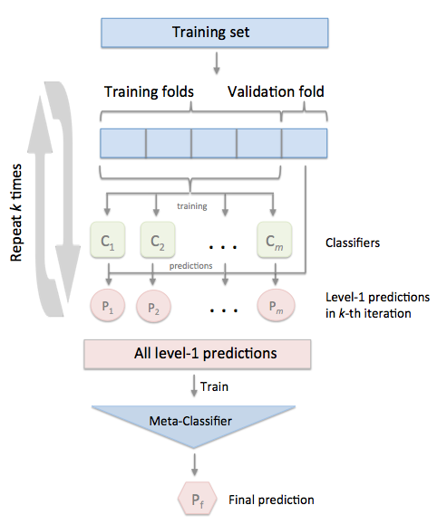
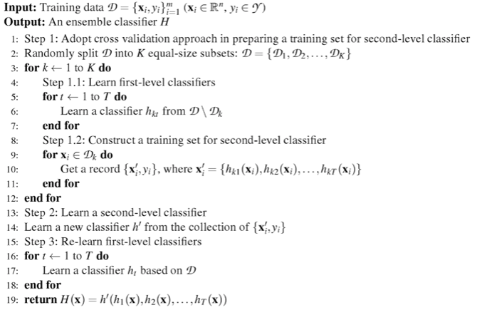

# Identification of Linear Interacting Peptides in protein structures (PDBs)

## Theoretical overview
Linear Interacting Peptides (LIPs) are intrinsically disordered regions (IDRs) that fold 
when interacting with other proteins or DNA/RNA molecules. 
In the PDB, LIPs are always found in complex with other molecules and can be easily 
recognized visually because retaining a certain degree of structural linearity. 
Compared to globular regions, LIPs are characterized by a larger surface of interaction
and a larger fraction of inter-chain over intra-chain contacts.

## Features
Various tests with different sets of features highlight that a good one is composed of:  
* accessible surface area (ASA), domain \[0, 1\]
* secondary structure, domain \{0, 1\}
* inter-/intra-chain contacts ratio, domain \[0, 1\]
* average bond free energy in Kj/mol, domain [0, ∞)
* average contact distance in Å, domain [0, ∞)

### Moving average
A moving average is computed for both secondary structure and contacts ratio features.
It is calculated over a window and the result is assigned to the central residue.
After the average, the contact ratio is re-scaled to lie in [0, 1].
A grid search strategy with cross validation is adopted to find a good window size for the moving average.

### Contact distance threshold 
A grid search algorithm with cross validation is adopted to select a good distance threshold 
to filter out too distant interactions between residues.

## Classification algorithm
For the classification task, we opted for a stacking (ensemble) classifier organized into 2 layers 
(see appendix for details).
Its first layer is build of five base classifiers, each one specialized in a different single feature.
The second layer (the last one) of the classifier is formed by only one classifier, 
that accepts as input the combined output probabilities of all the base classifiers.

### Stacking classifier training
Fase 1: Meta classifier training \
The training set is splitted using a Group 10-fold Cross validation (see appendix for details).
For each split, base classifiers are re-trained, 
predict output probabilities for unseen data, and we collect them.
At the end, all collected output probabilities form a new dataset.
Meta classifier is trained on this new dataset.

Fase 2: Final base classifiers training \
After meta classifier learning, base classifiers are re-trained on the full dataset (the original one).



## Hyperparameters Optimization
The hyperparameters selected to be optimized are: 
* window size for moving average, 
* interaction distance threshold,
* regularization strength for the base classifiers of the ensemble
* regularization strength for the meta classifier of the ensemble

We implemented a grid search to optimize all these parameters together, 
specifying a particular range of values, step size and type of space for each one of them.
The configuration chosen for grid search is: 
* for interaction distance threshold, min: 4, max: 10, step: 1, space: linear
* for window size for moving average, min: 30, max: 500, step:1, space: linear
* for regularization strengths, min: 10, max: 10^8, step: 10, space: geometric

Group 10-Fold Cross Validation (see appendix for details) 
is used for testing the quality of hyperparameter sets on previously unseen data.

### Final training
After the hyperparameters optimization, the classifier is trained on all the available data.

## Performances
The best LIP (ensemble) classifier achieved the scores:
* f-score: 0.934
* recall: 0.929
* precision: 0.95
* roc auc: 0.962

using the following (grid searched) hyperparameter values: 
* interaction distance threshold = 4.0 
* window size for moving average = 160
* regularization strength for base classifiers = 100 (C=0.01)
* regularization strength for meta classifier = 1000 (C=0.001)

It was tested with Group 10-Fold Cross Validation, grouping by pdb (structure id), see appendix for more details.


## Usage
### Training
#### Input
##### (Slow) Training with a base dataset (e.g. [lips_dataset_03](./resources/datasets/lips_dataset_03.txt))
````
$python lip_predictor.py -training_set lips_dataset_03.txt -store_augmented_dataset -pdb_dir pdbs/ -edges_dir edges/ -out_dir results/
````
where:
* `-training_set` accepts a path to a training set file.
* `-pdb_dir` accepts a path to a directory with pdb files. 
* `-edges_dir` accepts a path to a directory with edges files calculated by [RING](http://protein.bio.unipd.it/ring/). 
* `-store_augmented_dataset` (*optional*) saves an augmented dataset for speed up next training and/or for data analysis.
* `-out_dir` (*optional*) accepts a path to an output directory for storing predictions and/or a new configuration.
##### (Fast) Training with an augmented dataset (e.g. [lips_augmented_dataset](./resources/datasets/lips_augmented_dataset.csv))
This training procedure is faster than the previous one because it starts from a successive step with an aumented dataset. 
It needs not pdb or edges files but all input information is provided with the dataset.
````
$python lip_predictor.py -training_set lips_augmented_dataset.csv -training_set_type "AUGMENTED" -out_dir results/
````
where:
* `-training_set` accepts a path to a training set file.
* `-training_set_type` accepts a type of training set as a string. 
In particular, "AUGMENTED" type, is necessary to specify that the training set is augmented. 
* `-out_dir` (*optional*) accepts a path to an output directory for storing predictions and/or a new configuration.
#### Output
A configuration *.ini* file with algorithm parameters.
##### Example
    [base_learnerD]
    base_coefficient = 1.299
    base_intercept = -0.408
    ensemble_coefficient = 0.185
    
    [base_learnerG]
    base_coefficient = -5.078
    base_intercept = 3.747
    ensemble_coefficient = 0.294
    
    [base_learnerQ]
    base_coefficient = 16.688
    base_intercept = -1.344
    ensemble_coefficient = 0.520
    
    [GLOBAL]
    ensemble_intercept = -0.895
    window_size = 50
    residue_interaction_distance_threshold = 4.0 

### Prediction
````
$python lip_predictor.py -configuration parameters.ini -pdb_file pdb_name.pdb -edges_file name_edges.txt -out_dir results/
````
### Other options
* `-configuration` accepts a path to a file with a learned configuration.
* `-pdb_file` accepts a path to a pdb file. 
* `-edges_file` accepts a .txt file with edges calculated by [RING](http://protein.bio.unipd.it/ring/). 
* `-out_dir` (*optional*) accepts a path to an output directory for storing predictions.
#### Output
A text file in the following format
>\>pdb_id \
<residue_id (model/chain/position/insertion_code/name)> \<LIP score> \<LIP class>
##### Example
>\>1jsu \
0/C/25//K 0.343 0 \
0/C/26//P 0.453 0 \
0/C/27//S 0.574 1 \
0/C/28//A 0.615 1 \
0/C/29//C 0.831 1 \
0/C/30//R 0.808 1 \
0/C/31//N 0.747 1 \
0/C/32//L 0.304 0 \
0/C/33//F 0.233 0

### Training + Prediction
* fast training + prediction
````
$python lip_predictor.py -training_set lips_augmented_dataset.csv -training_set_type "AUGMENTED" -pdb_file pdb_name.pdb -edges_file name_edges.txt -out_dir results/
````

* slow training + prediction
````
$python lip_predictor.py -training_set lips_dataset_03.txt -store_augmented_dataset -pdb_dir pdbs/ -edges_dir edges/ -pdb_file pdb_name.pdb -edges_file name_edges.txt -out_dir results/
````
## Main dependencies
* [Biopython](https://github.com/biopython/biopython) - A set of tools for biological computation
* [DSSP](https://swift.cmbi.umcn.nl/gv/dssp/) - A program that assigns the most likely secondary structure 
to the 3D structure of a protein.
* [Residue Interaction Network Generator (RING)](http://protein.bio.unipd.it/ring/) -  A software that generates 
contact maps from protein structures
* [Scikit-learn](https://scikit-learn.org) - A set of tools for data mining and data analysis
* [Pandas](https://pandas.pydata.org/) - A library providing high-performance data structures and data analysis tools
* [NumPy](https://www.numpy.org/) - A package for scientific computing

## Tested on
* Python v3.6.5
* Biopython v1.73
* Scikit-learn v0.19.1
* Pandas v0.23.4
* Numpy v1.15.3

## Appendices 
### Group K Fold Cross validation
K-fold iterator variant with non-overlapping groups.

The same group will not appear in two different folds 
(the number of distinct groups has to be at least equal to the number of folds).

The folds are approximately balanced in the sense that the number of distinct groups is approximately 
the same in each fold.

In our specific case, a group corresponds to a pdb, identified by a structure id or a pdb name

### Stacking classifier algorithm
The stacking Cross-Validation algorithm can be summarized as follows:


